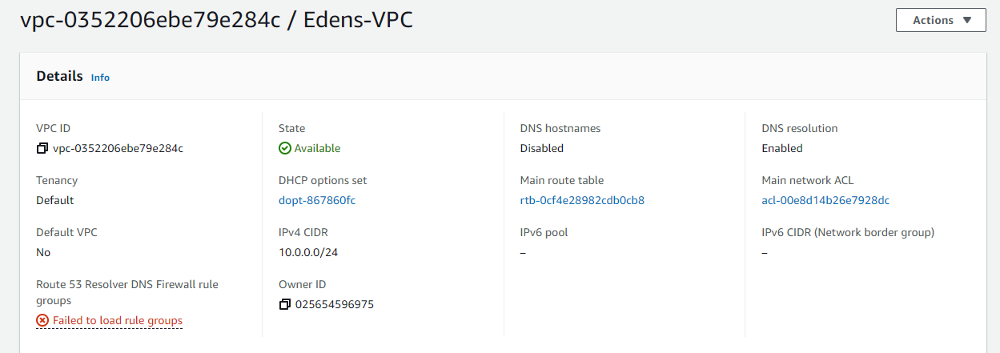

Part 1

1. 

I created a VPC which is basically a box that will hold my subnets and all of the rules and tools that I will use to connect devices and communicate. On it's own it
can't really do anything. I have this one an IP range of 10.0.0.0/24

2,
'![image of Subnet] ("Subnet.png")'
I then created a subnet and attached it to the VPC. This is a collection of private IP addresses that the VPC will treat as a single group. I followed allong with the example and used 10.0.0.28. 

3,
'![image of Gateway] ("Gateway.png")'
The Gateway is the portal that allows my VPC to access the internet and other devices it's use is governed by  the information found in the routing table.

4,
'![image of Routing Table] ("RouteTable.png")'
The Route Table sets the rules that govern where network traffic is allowed to go. My routing table identifies local network and sends all internet traficc through my gateway. 

5,
'![image of Security Group] ("SecurityGroup.png")'
The Security Group is a firewall that for the purposes of this project governs SSH access. My Security Group has inbound rules that permit SSH access from the WSU 
network, my home IP, and any other devices on the network. 

Part 2

1, New instance
	AMI: Amazon Linux 2
	default username: ect-user

2, Attach VPC
	On step 3 of creating an instance on AWS there is a menu called configure instance details. In the space after Network I selected my VPC.

3, Public IPV4 Address
	I chose not to use the public IPV4 option for two reasons.First, we have access to free elastic IP's. Second a rented public IP can be swaped by Amazon at
	any time which would be inconvenient for anyone trying to access my VPC.

4, Volume
	Step 4 of creating an instance on AWS was adding storage. Since this instance requires very little I left the size at the default value and ensured that	      Volume type was set to gp2 on the dropdown menu.

5, Tags
	Step 5 of creating an instance on AWS adding tags. I selected add new tag, gave it a key of "Name" and a value of Edens-instance.

6, Security Group
	Step 6 of creating an instance on AWS is configuring a security group. Since I had already created one for my VPC I selected the "Select an existing security         group" option and the chose my "Edens-sg" group.

7, Elastic IP 
	To create an 

8, The Instance 
  '![image of Running Instance] ("Instance.png")'
	 

9, SSH/Hostname
	After SSHing into the VMC I used the command $ sudo hostnamectl set-hostname Edens-AmazonL2 to change my hostname.

10, A succesfull SSH
  '![image of session on VMC] ("SSHComplete.png")'
	
 
Notes: I will say I was thrown at first by the term "Volume" I don't believe it was used in lecture until recap and the AWS system primarily refers to it as storage. Not to complain but I could see that tripping people up. 

I was given some instructions pertaining adding images into VIM in my project 1 feedback. I attempted to follow those instructions (as well as a few variations here).At the very least I don't see the images but just the commands I wrote. The images are also in my project 3 folder though so hopefully that will mitigate the problem somewhat. 

I've enjoyed your classes so far. They're interesting. 
  

